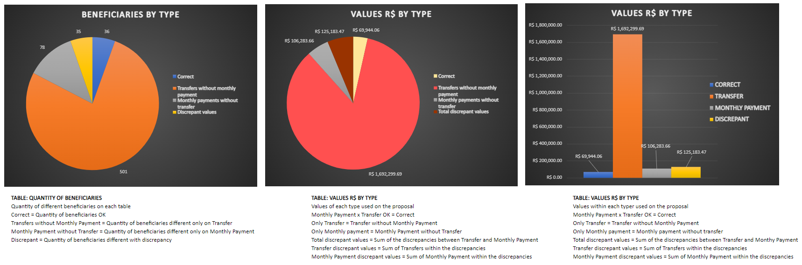
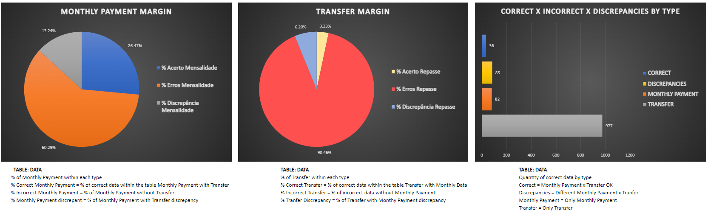
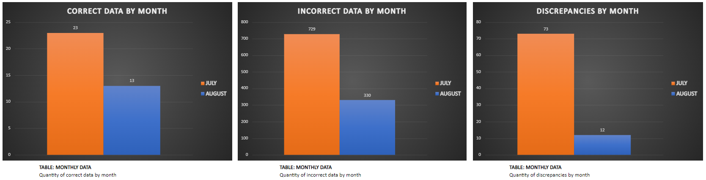

<p align="center">  </p>

<h1 align="center">CATE - Collect Analyze Treatment Exhibition</h1>

The project to be developed will be a health plan conciliation management system for the partner company [Dom Rock](https://www.domrock.net/) in conjunction with the College Fatec São José dos Campos Professor Jessen Vidal.

<h2 align="center">📋 Table of Contents</h2>

<!--ts-->
   * [Introduction](#cate---collect-analyze-treatment-exhibition)
   * [Features](#-features)
   * [Application Demo](#-application-demo)
   * [Project](#-project)
   * [Challenge](#-challenge)
   * [Solution](#-solution)
   * [Deliveries](#-deliveries)
   * [Running the System](#-running-the-system)
   * [Technologies](#-technologies)
   * [Members](#-members)
   * [Licenses](#-licenses)
   * [Project Dictionary](https://github.com/API-6-SEMESTRE/Documentation/blob/main/Files/dictionary.md)
<!--te-->

<h2 align="center">✅ Features</h2>

- [ ] Application of LGPD
- [ ] LOG for data tracking
- [ ] Storing raw data in MongoDB
- [ ] Storing processed data in a DW
- [ ] Reports using Power BI
- [ ] Bonus
  - [ ] Machine Learning Implementation

<h2 align="center">📺 Application demo</h2>

<div align="center">





</div>

<h2 align="center">🖥 Project</h2>

Project being developed in a partnership with Dom Rock, tech company that provides a platform which allows the capture of unstructured and structured data in an automated manner and promotes the optimized visualization of analyses, information, and data that enables recurring financial gains for various business areas of Dom Rock's clients. The platform was designed and built with the most advanced technologies of big data and artificial intelligence with self-scaling cloud architecture. In recent years the platform has been recognized as one of the best in Brazil by qualified rankings and through open innovation programs of large corporations and organizations.

<h2 align="center">📈 Challenge</h2>

Challenge proposed by Dom Rock - The client manages a health plan management system that has the following need: A solution that reconciles information from a health operator's demonstrative and the list of beneficiaries of that operator's health plans for each monthly competence. As the data contains personal information, the implementation of the LGPD (Brazilian General Data Protection Law) law is mandatory for audit purposes.

<h2 align="center">💡 Solution</h2>

CATE is the project that enables better data management, allowing for better performance, integrity, security, and privacy.
With a good data flow defined, it is possible to generate discrepancies reports and display them to the controller, allowing for quick correction.

<h2 align="center">💎 Deliveries</h2>

Below is the planning and progress during the project Sprints.

|   **SPRINT**    |  **DELIVERY DATE**  | **WHAT WILL BE DELIVERED** |
|-----------------|-----------------------|-------------------------|
|  1  |  08/29/2022 to 09/18/2022  | Application of LGPD on data, Data Modeling, Generating Logs for data tracking, Persistence of raw data in MongoDB.
|  2  |  09/19/2022 to 10/09/2022  | Analysis and treatment of data via Python, Persistence of data processed in MongoDB.
|  3  |  10/13/2022 to 11/06/2022  | Modeling and implementation of the DW, Persistence of relevant data in the DW.
|  4  |  11/07/2022 to 11/27/2022  | Power BI modeling and implementation, Integration between DW and Power BI, Power BI reports, Machine Learning (bonus).

<h2 align="center">🚀 Running the System</h2>

<h3>📑 Prerequisites</h3>

Before starting, you will need installed in your machine the following tools:
[Git](https://git-scm.com), [Python](https://www.python.org/) and [PIP](https://pypi.org/project/pip/).
Besides this it is good to have an IDE to work with the code, for example [VSCode](https://code.visualstudio.com/) or [PyCharm](https://www.jetbrains.com/pt-br/pycharm/).

<h3>🎲 Running Python</h3>

```bash
# Clone this repository
$ git clone https://github.com/API-6-SEMESTRE/Projeto

# Run the following command in the terminal to isntall the PIP libraries
$ pip install -r src/requirements.txt

# Run the following commands:

## BRONZE Level - Data extraction from the sheets and data persistence on MongoDB WITHOUT data anonymization
$ python3 src/extractor.py -l bronze

## Silver Level - Data extraction from the sheets and data persistence on MongoDB WITH data anonymization
$ python3 src/extractor.py -l silver

# Done! The data was persisted on MongoDB accordingly to the selected option.
```

<h2 align="center">🛠 Technologies</h2>

The following tools were used in building the project:

<p align="center">
 <a href="https://www.mongodb.com/">
  
 </a>
 <a href="https://www.mysql.com/">
  
 </a>
 <a href="https://powerbi.microsoft.com/pt-br/">
  
 </a>
</p>
<p align="center">
  <a href="https://www.python.org/">
  
</a>
<a href="https://pandas.pydata.org/">
  
</a>
<a href="https://pypi.org/project/pip/">
  
</a>
</p>
<p align="center">
  <a href="https://git-scm.com/">
  
</a>
  <a href="https://github.com/">
  
</a>
<a href="https://www.atlassian.com/br/software/jira">
  
 </a>
 <a href="https://www.microsoft.com/pt-br/microsoft-teams/log-in">
  
 </a>
</p>

<h2 align="center">👥 Members</h2>

<table align="center">
    <tr>
        <td align="center">
            <a href="https://linkedin.com/in/tairik-nishimura/">
                
                <br />
                <sub>
                    <b>Tairik Johnny</b>
                </sub>
            </a>
            <br />
            <p>Scrum Master</p>
            <a href="[https://www.mongodb.com/](https://linkedin.com/in/tairik-nishimura/)">
              
            </a>
        </td>
        <td align="center">
            <a href="https://www.linkedin.com/in/maxx-barcelos-aaa106b2/">
                
                <br />
                <sub>
                    <b>Maximiles Barcelos</b>
                </sub>
            </a>
            <br />
            <p>Product Owner</p>
            <a href="https://www.linkedin.com/in/maxx-barcelos-aaa106b2/">
              
            </a>
        </td>
        <td align="center">
            <a href="https://www.linkedin.com/in/jeferson-tadeu-das-neves-a98343190/">
                
                <br />
                <sub>
                    <b>Jeferson Neves</b>
                </sub>
            </a>
            <br />
            <p>Developer</p>
            <a href="https://www.linkedin.com/in/jeferson-tadeu-das-neves-a98343190/">
              
            </a>
        </td>
        <td align="center">
            <a href="https://linkedin.com/in/devanir-ramos-junior/">
                
                <br />
                <sub>
                    <b>Devanir Ramos</b>
                </sub>
            </a>
            <br />
            <p>Developer</p>
            <a href="https://linkedin.com/in/devanir-ramos-junior/">
              
            </a>
        </td>
    </tr>
    <tr>
        <td align="center">
            <a href="https://www.linkedin.com/in/jos%C3%A9-francisco-forneiro-junior/">
                
                <br />
                <sub>
                    <b>José Francisco</b>
                </sub>
            </a>
            <br />
            <p>Developer</p>
            <a href="https://www.linkedin.com/in/jos%C3%A9-francisco-forneiro-junior/">
              
            </a>
        </td>
        <td align="center">
            <a href="https://www.linkedin.com/in/alan-bezerra/">
                
                <br />
                <sub>
                    <b>Alan Lucas</b>
                </sub>
            </a>
            <br />
            <p>Developer</p>
            <a href="https://www.linkedin.com/in/alan-bezerra/">
              
            </a>
        </td>
        <td align="center">
            <a href="https://www.linkedin.com/in/leonardo-gabriel-silva-11b8b8178/">
                
                <br />
                <sub>
                    <b>Leonardo Gabriel</b>
                </sub>
            </a>
            <br />
            <p>Developer</p>
            <a href="https://www.linkedin.com/in/leonardo-gabriel-silva-11b8b8178/">
              
            </a>
        </td>
        <td align="center">
            <a href="https://www.linkedin.com/in/henrique-zucareli-santiago/">
                
                <br />
                <sub>
                    <b>Henrique Zucareli</b>
                </sub>
            </a>
            <br />
            <p>Developer</p>
            <a href="https://www.linkedin.com/in/henrique-zucareli-santiago/">
              
            </a>
        </td>
    </tr>
</table>

<h2 align="center">📝 License</h2>

All information resulting from Learning through Integrated Projects at Fatec São José dos Campos - Prof. Jessen Vidal follows the Open Source Initiative (OSI) or Academic Free License 3.0 (AFL-3.0) license.
